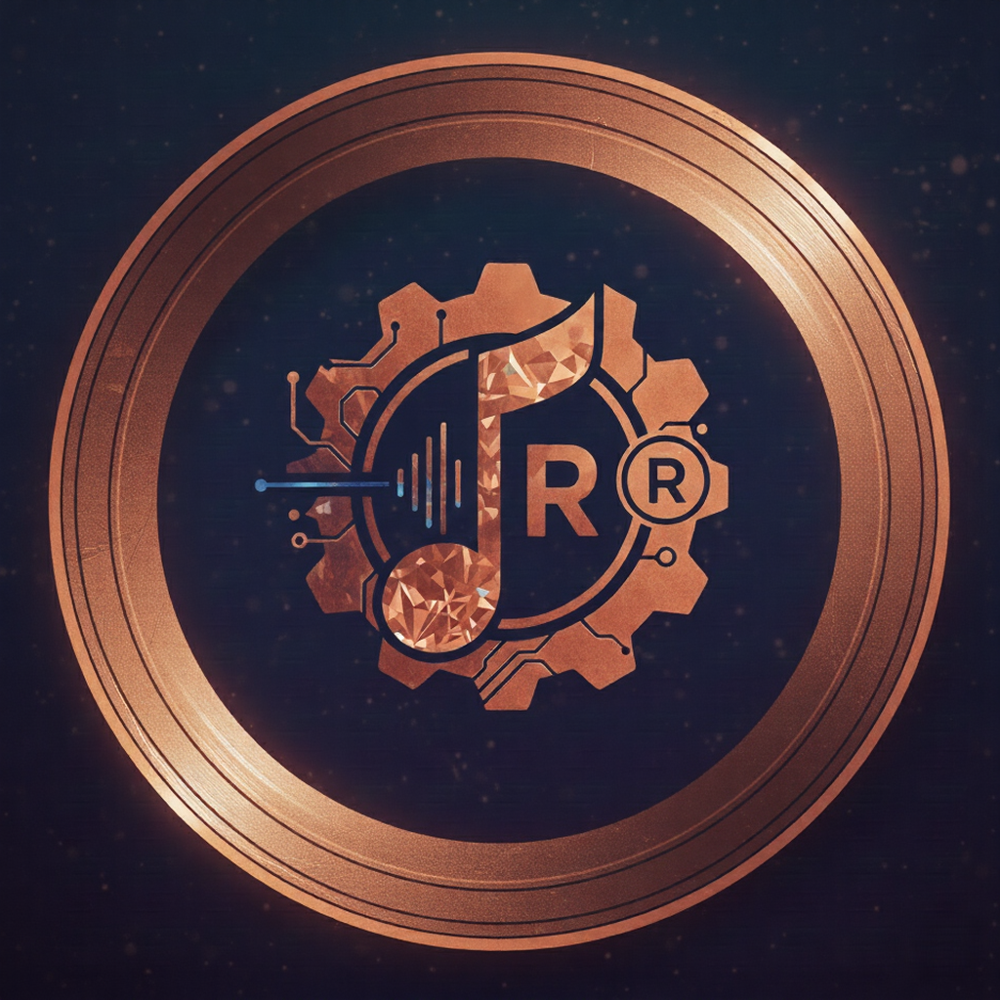

# RustySound

A cross-platform music streaming client for Navidrome and Subsonic-compatible servers, built with Rust and Dioxus.



## Features

- 🎵 **Multi-platform Support**: Available on Desktop (macOS, Windows, Linux), Mobile (iOS, Android), and Web
- 🎧 **Audio Playback**: High-quality audio streaming with queue management
- 📱 **Server Integration**: Connect to Navidrome and Subsonic-compatible music servers
- 💾 **Local Storage**: Persistent settings and playback state across sessions
- 🎼 **Playlist Management**: Create and manage playlists
- 🔍 **Search & Browse**: Browse your music library by artists, albums, and tracks
- 🎚️ **Audio Controls**: Play, pause, skip, shuffle, and repeat functionality
- 🌙 **Modern UI**: Clean, responsive interface built with Tailwind CSS

## Supported Platforms

### Desktop

- **macOS**: DMG installer and native .app bundle
- **Windows**: MSI installer and portable EXE
- **Linux**: AppImage bundle

### Mobile

- **iOS**: App Store distribution
- **Android**: Google Play Store distribution

### Web

- **Browser**: WebAssembly-based web application
- **Progressive Web App**: Installable PWA support

## Installation

### Desktop

#### macOS

1. Download the latest `.dmg` file from [Releases](https://github.com/AD-Archer/RustySound/releases)
2. Open the DMG and drag RustySound to your Applications folder

#### Windows

1. Download the latest `.msi` installer from [Releases](https://github.com/AD-Archer/RustySound/releases)
2. Run the installer and follow the setup wizard

#### Linux

1. Download the latest `.AppImage` file from [Releases](https://github.com/AD-Archer/RustySound/releases)
2. Make it executable: `chmod +x RustySound-*.AppImage`
3. Run: `./RustySound-*.AppImage`

### Mobile

Coming soon to App Store and Google Play Store.

### Web

Visit [rustysound](https://rustysound.adarcher.app) to use the web version.

#### Docker Deployment

You can also run RustySound as a Docker container:

1. Ensure you have Docker and Docker Compose installed
2. Clone this repository or download `docker-compose.yml`
3. Run the application:

```bash
docker-compose up -d
```

The web interface will be available at `http://localhost:8080`.

To stop the container:

```bash
docker-compose down
```

#### Manual Docker Run

If you prefer to run the container directly:

```bash
docker run -d -p 8080:80 --name rustysound ghcr.io/ad-archer/rustysound:latest
```

### Prerequisites

- Rust 1.70+ ([install here](https://rustup.rs/))
- Dioxus CLI: `curl -sSL https://dioxus.dev/install.sh | sh`

### Setup

1. Clone the repository:

```bash
git clone https://github.com/AD-Archer/RustySound.git
cd RustySound
```

2. Install dependencies:

```bash
cargo build
```

### Running the Application

#### Development Server

```bash
dx serve
```

#### Specific Platforms

```bash
# Web (default)
dx serve --platform web

# Desktop
dx serve --platform desktop

# Mobile (iOS Simulator)
dx serve --platform ios

# Mobile (Android Emulator)
dx serve --platform android
```

### Building for Production

#### Desktop Bundles

```bash
dx bundle --platform desktop --release
```

#### Mobile Builds

```bash
# iOS
dx bundle --platform ios --release

# Android
dx bundle --platform android --release
```

## Project Structure

```
rustysound/
├── assets/                 # Static assets (icons, styles, etc.)
├── src/
│   ├── main.rs            # Application entry point
│   ├── components/        # Reusable UI components
│   │   ├── app.rs         # Main app component
│   │   ├── player.rs      # Audio player controls
│   │   ├── sidebar.rs     # Navigation sidebar
│   │   └── views/         # Page components
│   │       ├── home.rs    # Home/dashboard
│   │       ├── albums.rs  # Album browser
│   │       ├── artists.rs # Artist browser
│   │       ├── queue.rs   # Playback queue
│   │       └── settings.rs # App settings
│   ├── api/               # Server API integration
│   ├── db/                # Local database/storage
│   └── components.rs      # Component exports
├── Cargo.toml             # Rust dependencies
├── Dioxus.toml           # Dioxus configuration
└── tailwind.css          # Tailwind CSS styles
```

## Configuration

### Server Connection

1. Launch RustySound
2. Go to Settings
3. Add your Navidrome/Subsonic server details:
   - Server URL
   - Username
   - Password (optional, depending on server setup)

### Supported Servers

- **Navidrome**: Full feature support
- **Subsonic**: Compatible with Subsonic API v1.16.1+
- **Airsonic**: Compatible servers
- **Gonic**: Compatible servers

## Contributing

1. Fork the repository
2. Create a feature branch: `git checkout -b feature/your-feature`
3. Make your changes and test thoroughly
4. Submit a pull request

### Development Guidelines

- Follow Rust best practices
- Use Dioxus component patterns
- Test on multiple platforms when possible
- Update documentation for new features

## License

Copyright © 2026 AD-Archer. All rights reserved.

## Acknowledgments

- Built with [Dioxus](https://dioxuslabs.com/) - A Rust UI framework
- Audio playback powered by Web Audio API and native platform APIs
- Icons and UI design inspired by modern music streaming applications
